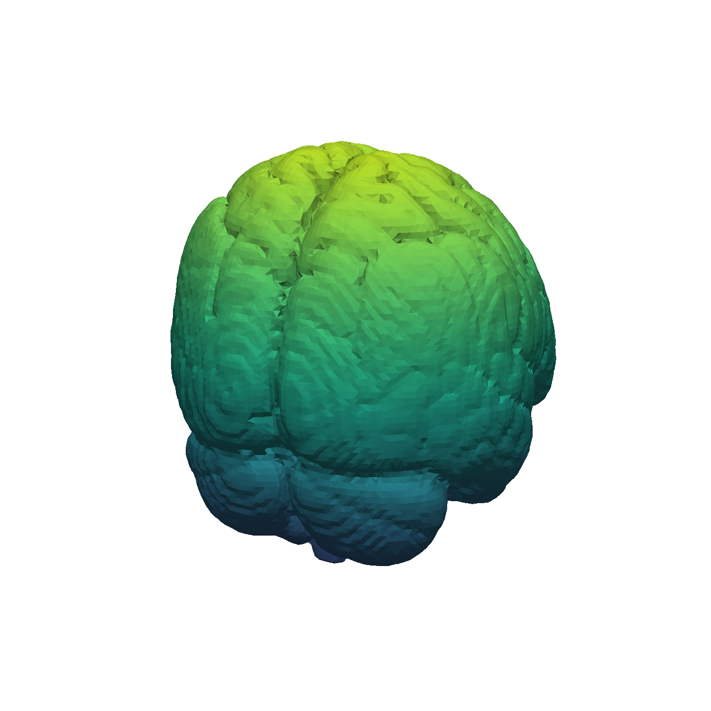

# Marching Cubes Benchmark

This project implements the Marching Cubes surface reconstruction algorithm in modern C++ and CUDA.

The current implementation reads a scalar field from a text file, extracts an isosurface, builds triangles, and writes the result as an ASCII `.ply` mesh.



## Run

```bash
./build/MarchingCubes <input.txt> <output.ply> <cpu|cpu-parallel|cuda|heterogeneous> <isoValue>
```

## Benchmark

Benchmark numbers for the Marching Cubes algorithm.

Test input:

- File: `files/input.txt`
- Grid: `69 x 64 x 72`
- Iso value: `0.45`
- Generated triangles: `58,320`

| Mode | Threads | Algorithm Time |
| --- | ---: | ---: |
| `cpu` | 1 | `169.181 ms` |
| `cpu-parallel` | 8 | `33.5242 ms` |

## Algorithm Reference

The Marching Cubes implementation is based on Paul Bourke's polygonising scalar field reference:

https://paulbourke.net/geometry/polygonise/
