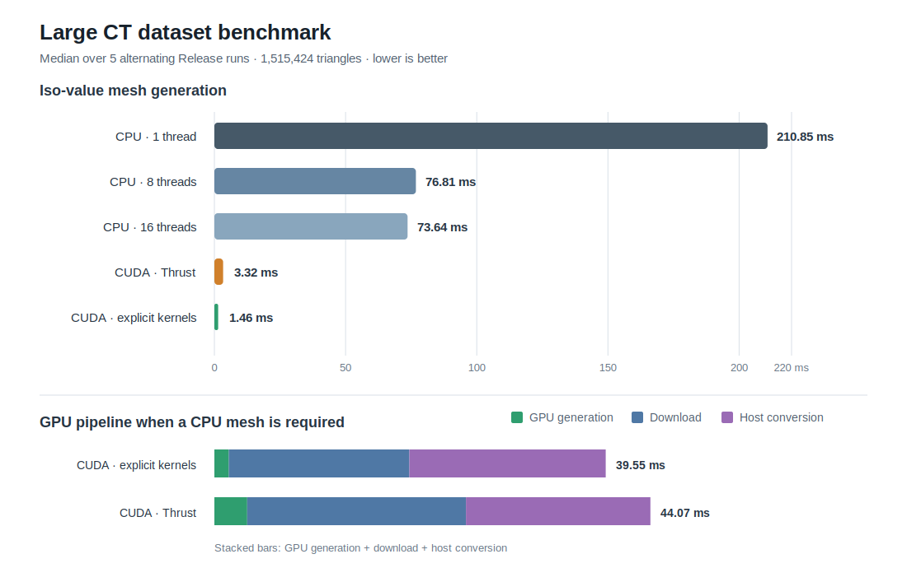

# Marching Cubes

This project implements the Marching Cubes surface reconstruction algorithm in C++23 and CUDA/Thrust.

It reads a regular scalar field from a text file, extracts an isosurface, generates triangles, and writes the result as an ASCII `.ply` mesh.

## Current Large Benchmark

The current comparison uses a larger local CT scalar field and a Release build:

- Grid: `128 x 128 x 267`
- Generated triangles: `1,515,424`
- CPU: Intel Core Ultra 7 255H, 16 available hardware threads
- GPU: NVIDIA GeForce RTX 5070 Laptop GPU
- Toolchain: GCC 14.2 and CUDA 13.3

<p align="center">
  
</p>

### Iso-value update performance

| Implementation | Mesh generation |
|---|---:|
| CPU, 1 thread | `210.85 ms` |
| CPU, 8 threads | `76.81 ms` |
| CPU, 16 threads | `73.64 ms` |
| CUDA, Thrust | `3.32 ms` |
| CUDA, explicit kernels | **`1.46 ms`** |

For this workload, the explicit CUDA kernel generation is `2.27x` faster than Thrust, `50.5x` faster than the 16-thread CPU path, and `144.5x` faster than the sequential CPU path.

The GPU generation timer covers triangle counting, exclusive scan, output allocation, and triangle generation. It excludes scalar-field loading, initial GPU setup, full mesh download, host conversion, and PLY writing. This is the relevant iso-slider reaction time when the scalar field and generated mesh remain on the GPU for rendering.

### GPU transfer and conversion

| Implementation | GPU generation | Download | Host conversion | CPU-ready mesh |
|---|---:|---:|---:|---:|
| CUDA, explicit kernels | **`1.46 ms`** | **`18.25 ms`** | `19.84 ms` | **`39.55 ms`** |
| CUDA, Thrust | `3.32 ms` | `22.11 ms` | **`18.64 ms`** | `44.07 ms` |

Download time includes allocating host output storage and copying all `1,515,424` triangles from the GPU. 

Both GPU implementations generate byte-identical PLY output. CPU output has the same triangle count and geometry, with small floating-point rounding differences.

## Implementations

- `cpu`: sequential C++23 implementation.
- `cpu-parallel`: multithreaded C++23 implementation with a configurable thread limit.
- `heterogeneous`: GPU implementation using Thrust algorithms and device functors.
- `cuda`: explicit CUDA implementation using one thread per cube, two custom kernels, constant-memory lookup tables, and CUB for the exclusive scan.

Both GPU implementations use two passes. The first pass counts the triangles produced by each cube. An exclusive scan converts those counts into non-overlapping output offsets. The second pass generates the triangles directly into the final GPU buffer without atomics.

## Build

Requirements:

- CMake 3.22 or newer.
- A C++23 compiler.
- CUDA 12.4 or newer.

CUDA is required. CMake configuration stops with an error when a supported CUDA compiler is unavailable.

```bash
cmake -S . -B build
cmake --build build -j
```

When multiple CUDA versions are installed, select the supported NVCC explicitly:

```bash
cmake --fresh -S . -B build \
  -DCMAKE_CUDA_COMPILER=/usr/local/cuda-13.3/bin/nvcc
cmake --build build -j
```

## Run

```bash
./build/MarchingCubes <input.txt> <output.ply> <cpu|cpu-parallel|cuda|heterogeneous> <isoValue> [cpu-parallel-threads]
```

The optional final argument caps worker threads for `cpu-parallel` runs. If omitted, `cpu-parallel` uses the available hardware thread count.

Examples:

```bash
./build/MarchingCubes files/input.txt output.ply cpu 0.45
./build/MarchingCubes files/input.txt output.ply cpu-parallel 0.45 8
./build/MarchingCubes files/input.txt output.ply heterogeneous 0.45
./build/MarchingCubes files/input.txt output.ply cuda 0.45
```

## Algorithm Reference

The Marching Cubes implementation is based on Paul Bourke's polygonising scalar field reference:

https://paulbourke.net/geometry/polygonise/
