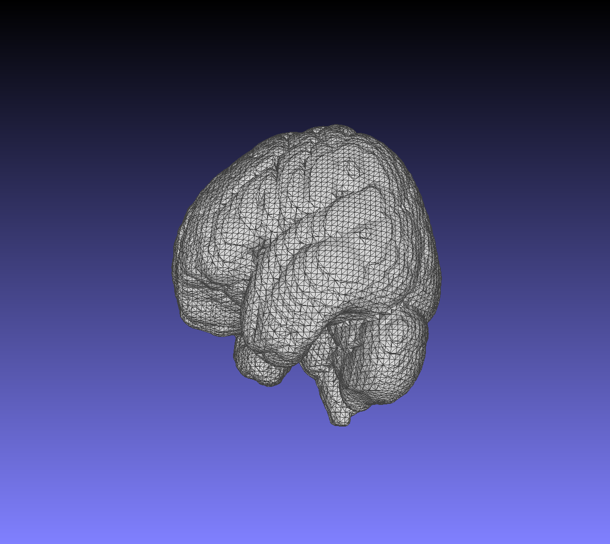
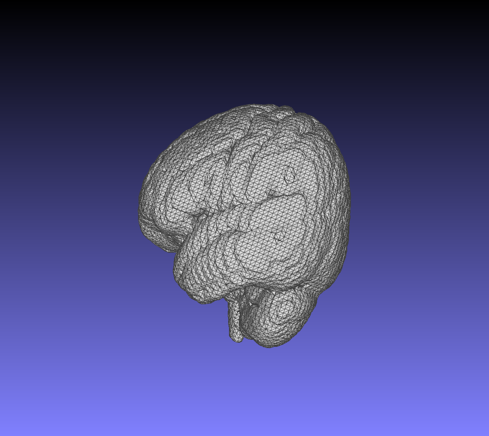

# Marching Cubes Benchmark

This project implements the Marching Cubes surface reconstruction algorithm in modern C++ and CUDA.

The current implementation reads a scalar field from a text file, extracts an isosurface, builds triangles, and writes the result as an ASCII `.ply` mesh.

<p>
  
  
</p>

## Run

```bash
./build/MarchingCubes <input.txt> <output.ply> <cpu|cpu-parallel|cuda|heterogeneous> <isoValue> [cpu-parallel-threads]
```

The optional final argument caps worker threads for `cpu-parallel` runs. If omitted, `cpu-parallel` uses the available hardware thread count.

## Benchmark

Benchmark numbers for the Marching Cubes algorithm.

Test input:

- File: `files/input.txt`
- Grid: `69 x 64 x 72`
- Iso value: `0.45`
- Generated triangles: `58,320`

| Machine | Mode | Threads | Algorithm Time |
| --- | --- | ---: | ---: |
| Intel core i7-4870HQ (Mac) | `cpu` | 1 | `169.181 ms` |
| Intel core i7-4870HQ (Mac)  | `cpu-parallel` | 8 | `33.5242 ms` |
| Intel Core Ultra 7 255H | `cpu` | 1 | `74.1075 ms` |
| Intel Core Ultra 7 255H | `cpu-parallel` | 8 | `23.4356 ms` |
| Intel Core Ultra 7 255H | `cpu-parallel` | 16 | `19.9027 ms` |

Linux benchmark numbers are averages over 5 runs on Ubuntu 24.04 with GCC 14.2.0. MacBook Pro numbers are from the earlier Intel macOS run.

## Algorithm Reference

The Marching Cubes implementation is based on Paul Bourke's polygonising scalar field reference:

https://paulbourke.net/geometry/polygonise/
